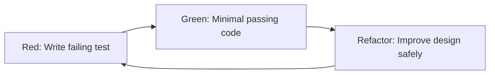

# TDD: Brief History and What It Is

---

## [Previous](05-lightbulb-moment.md) | [Home](README.md) | [Next](06a-frontend-unit-tests.md)

---

## Quick Grounding

- Popularized in Extreme Programming (late 1990s)
- Built on xUnit testing culture
- Associated strongly with Kent Beck's practice guidance

---

## One-Sentence Definition

Write a failing test, write the minimal code to pass it, then refactor safely.

---

## Red -> Green -> Refactor

This is not a testing ritual. It is a design loop.

---

## Plain-English Version

Before I build the feature, I write down how I will know it works.
Then I code just enough to make that statement true.
Then I clean up.
